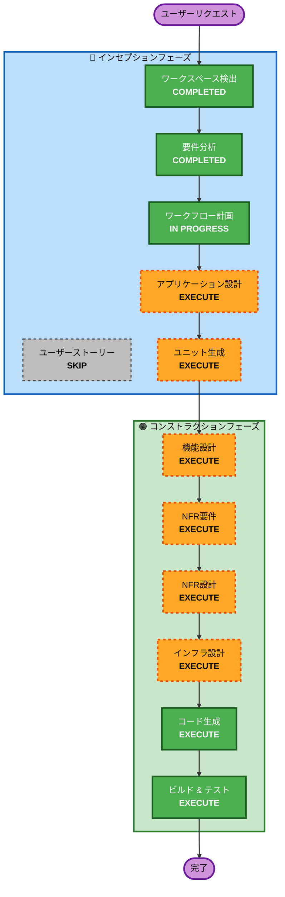

# 実行計画

## 詳細分析サマリー

### 変更影響評価
- **ユーザー向け変更**: あり — TUIペット育成体験、Webサイトでの登録/ログイン
- **構造変更**: あり — 3コンポーネント（TUI + Web + AWS）の新規構築
- **データモデル変更**: あり — DynamoDBテーブル設計（Users, Pets, Graveyard）
- **API変更**: あり — REST API新規設計（AI応答、データ管理）
- **NFR影響**: あり — セキュリティ（SECURITY-01〜15）、PBT（PBT-01〜10）

### リスク評価
- **リスクレベル**: Medium
- **ロールバック複雑さ**: 低（グリーンフィールドのため）
- **テスト複雑さ**: 中（3コンポーネント間の結合テストが必要）

---

## ワークフロー可視化



### テキスト代替（ワークフロー可視化）
```
インセプションフェーズ:
  ワークスペース検出 (COMPLETED) → 要件分析 (COMPLETED) → ワークフロー計画 (IN PROGRESS)
  → アプリケーション設計 (EXECUTE) → ユニット生成 (EXECUTE)
  ※ ユーザーストーリー (SKIP)

コンストラクションフェーズ（ユニットごと）:
  機能設計 (EXECUTE) → NFR要件 (EXECUTE) → NFR設計 (EXECUTE)
  → インフラ設計 (EXECUTE) → コード生成 (EXECUTE) → ビルド&テスト (EXECUTE)
```

---

## 実行するフェーズ

### 🔵 インセプションフェーズ
- [x] ワークスペース検出 (COMPLETED)
- [x] 要件分析 (COMPLETED)
- [x] ワークフロー計画 (IN PROGRESS)
- [ ] アプリケーション設計 - **EXECUTE**
  - **理由**: 3コンポーネント（TUI/Web/AWS）の新規設計が必要。コンポーネント間のAPI設計、サービスレイヤー定義、依存関係の明確化が必要
- [ ] ユニット生成 - **EXECUTE**
  - **理由**: 3つの独立したコンポーネント（TUIクライアント、紹介Webサイト、AWSバックエンド）に分解し、それぞれの実装順序と依存関係を定義する必要がある

### 🟢 コンストラクションフェーズ（ユニットごと）
- [ ] 機能設計 - **EXECUTE**
  - **理由**: パラメータ計算ロジック、進化判定、EXP計算、死亡判定、AI応答生成のビジネスロジックが複雑で詳細設計が必要
- [ ] NFR要件 - **EXECUTE**
  - **理由**: セキュリティ拡張（SECURITY-01〜15）とPBT拡張（PBT-01〜10）が有効。技術スタック選定の確認も必要
- [ ] NFR設計 - **EXECUTE**
  - **理由**: NFR要件で特定されたパターンをアーキテクチャに組み込む設計が必要
- [ ] インフラ設計 - **EXECUTE**
  - **理由**: API Gateway、Lambda、DynamoDB、Cognito、Bedrockの具体的なリソース設計とCDKテンプレート設計が必要
- [ ] コード生成 - **EXECUTE**（常時実行）
  - **理由**: 実装計画の策定とコード生成
- [ ] ビルド & テスト - **EXECUTE**（常時実行）
  - **理由**: ビルド手順、テスト実行手順の策定

## スキップするフェーズ

### 🔵 インセプションフェーズ
- ユーザーストーリー - **SKIP**
  - **理由**: 要件分析で機能要件（FR-01〜FR-11）が十分に定義済み。ユーザータイプは開発者のみで単一ペルソナ。ユーザーストーリーの追加価値が限定的

### 🟡 オペレーションフェーズ
- オペレーション - **PLACEHOLDER**
  - **理由**: 将来の拡張用プレースホルダー

---

## 成功基準
- **主目標**: devpet TUIツールが動作し、ペット育成・AI応答・クラウド同期が機能すること
- **主要成果物**:
  - Go + bubbletea TUIクライアント（クロスプラットフォームバイナリ）
  - Next.js紹介Webサイト（Cognito登録/ログイン付き）
  - AWSバックエンド（API Gateway + Lambda + DynamoDB + Bedrock + Cognito）
  - AWS CDK IaCテンプレート
  - PBTを含む包括的テストスイート
- **品質ゲート**:
  - セキュリティ拡張ルール（SECURITY-01〜15）準拠
  - PBT拡張ルール（PBT-01〜10）準拠
  - クロスプラットフォームビルド成功（Linux, macOS, Windows）
